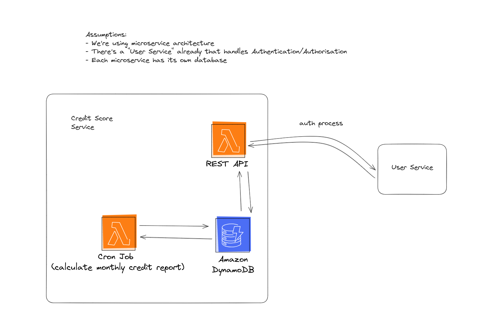
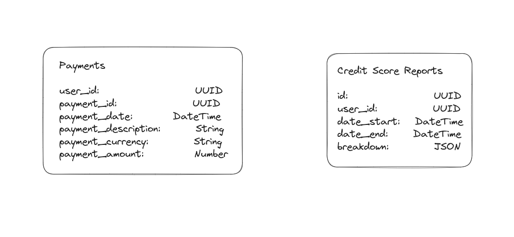

# Bits Challenge

> Disclaimer: The CDK setup seems to be breaking even when everything it's according to documentation (not even ChatGPT is helping) so I've commented it out so at least you can spin the setup up. Also, I couldn't get CDK to config the local DynamoDB container. I'm not happy that's not working properly but I would need to setup an AWS account and take the proper time to get it working for real.

## Getting started

```sh
# works for Linux and MacOS. it should technically work for Windows as well but fs events don't get propagated :(
npm run docker:clean

# run the CDK stack. Tried automating this step but no luck
docker exec bits-server sh -c "npm run cdk:local"

# run tests
docker exec bits-server sh -c "npm run test"
```

## OpenApi & Documentation

-   Once dev environment is running, navigate to http://localhost:4112/docs
-   For the openapi.json spec, navigate to http://localhost:4112/docs/swagger.json

## High level architecture

System Overview 

Database Schema 

## The Lambda dilemma

> One function with an Express server vs one function per endpoint?

There's advantages and disadvantages to both approaches (typical). To list a few:

| Strategy              | Pros                                | Cons                                             |
| --------------------- | ----------------------------------- | ------------------------------------------------ |
| server on a function  | Easier to maintain/debug            | Slower cold start                                |
|                       | Easier to port                      | Nested routing                                   |
|                       | Enables GraphQL and other features  |                                                  |
| --------------------- | ----------------------------------- | ------------------------------------------------ |
| function per endpoint | It's the Lambda way                 | Endpoint definition is spread across many things |
|                       | Fine grained control on API gateway | Vendor locked                                    |

For this test and in general, I prefer the "server on a function" approach. It seems a bit over complicated at first, since the lambda function is already being routed by API gateway then it's spinning a router before handling the request but it makes it a lot easier to maintain. From the deployment point of view, there's one function per microservice, which makes it a lot easier to trace, monitor and maintain and debug when something goes wrong

## Authentication

### The fancy way

A fancy way of doing authentication/authorisation would be using IAM policies definition on API gateway. This paired with Cognito would yield the most robust security AWS offers.

### The boring way

Without proper understanding of Bits architecture and systems however. I'd refer back to good ol' JWT. For the purpose of this exercise I'll assume the following:

-   The API gateway is User Facing. This mean clients outside the VPC are communicating directly with this service through only one layer of API gateway
-   Authentication and Authorisation are centrally handled by "User" microservice (which may or maynot be using Oauth or federated authentication)

Steps:

1. The service will receive a `Bearer` token on the `Authorization` header. Since it's user facing, it should not assume the session JWT was previously validated and therefore will call the "User Service" to check the validity of the token
2. if the "User service" responds with 200 or 204. Then the service will understand the session is valid and will proceed with the request. If the response is 401 or 403. then it'll halt the request and respond with same error code
3. If the auth check is successful, the service will extract the `user_id` from the session token and apply localised authorisation rules, such as the `user_id` can only fetch credit score reports where `user_id` is the same as the session.

## Operational Scaling

100k monthly active users are not that many, and the endpoint is simply doing one write to a database, therefore the basic limitations of lambdas (1000 concurrent executions) should be enough. I'm a firm believer of KISS (keep it simple, stupid) so in the event of needed more compute, my first instinct would be to talk to the AWS team to increase the limit before resorting to queuing and batching mechanisms. If the compute requirements extremely exceeds the capacity of Lambda, I would opt for changing the implementation form Lambda to Elastic Beanstalk or ECS or even EKS. Mind you, this would only be feasible because I chose `server on a function`
